# New Quant user walkthrough

_Watch the tutorial walkthrough at_ [_YouTube_](https://youtu.be/FFXbKcBOjJg)\_\_

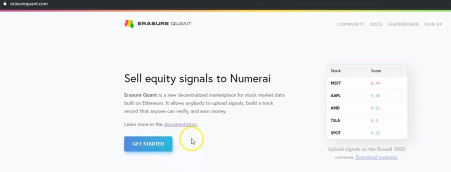

_\(0:21\)_ First, you’ll need to either click Get Started or ‘sign up’.

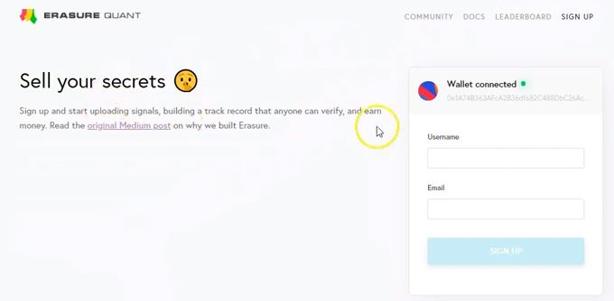

_\(0:26\)_ The next screen will ask you to create a username for your account and for your email address. Fill in both fields and click Sign Up.

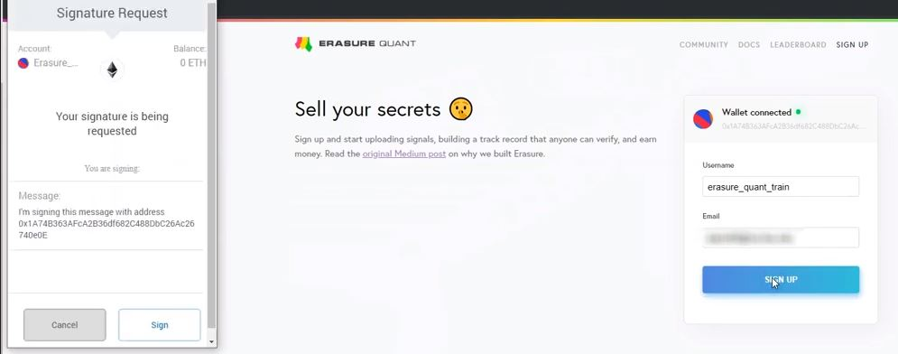

\(0:42\) 
 Metamask will prompt you with a pop-up for a signature request. You will need to click sign.

A “success message” will follow, asking you to check your email. Click the link in your email to activate your account.

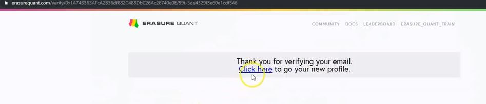


\(0:54\) Once you click the link, you will be taken back to the erasure quant website where you will be asked to click another link. Click the link to go to your new profile.

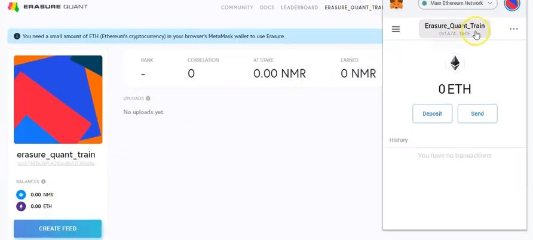

\(1:40\) You’ll need to fund your account with ether. I’ll demonstrate how this is done using Metamask, but there are many other ways to fund your Erasure Quant account. Click your metamask wallet to copy your address.

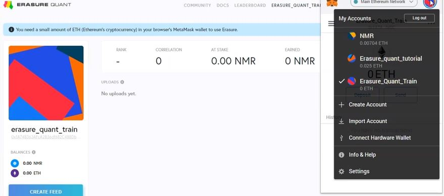

\(1:58\) Then, click the rightmost circle and select the account you’ll be withdrawing from. Click “send”, then ‘transfer between my accounts’. Select the account that you want to make the deposit to. Transfer whatever amount you want by typing in the amount in the ‘amount’ field. 

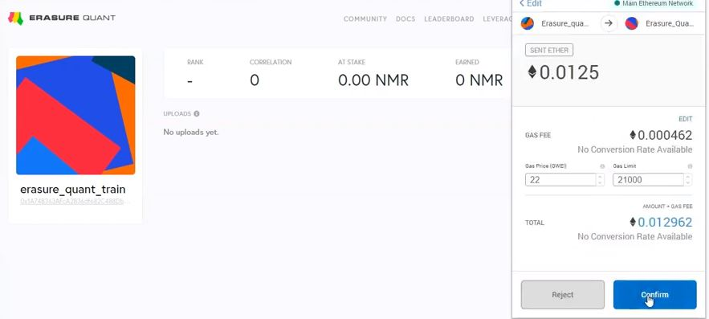

\(2:16\) Click next, then click Confirm.

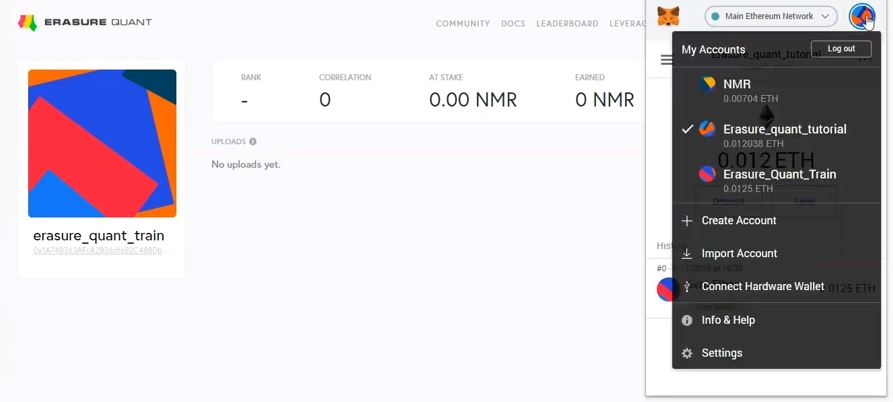

\(2:41\) Next, click the right most circle to switch over to your erasure quant wallet, and you’ll see the successful transfer.

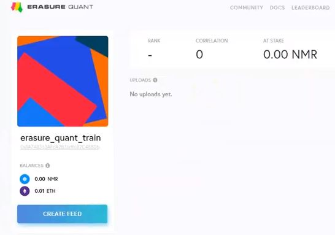

\(2:47\) Next, we’ll click Create Feed.

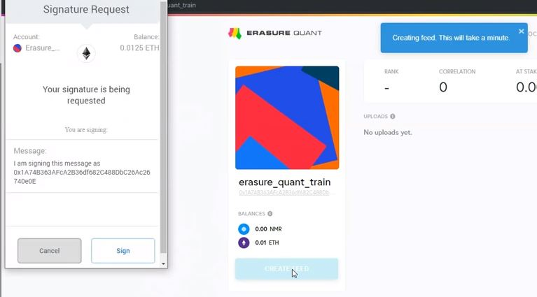

\(2:55\) Metamask will again ask you to sign the message, so click ‘sign.’

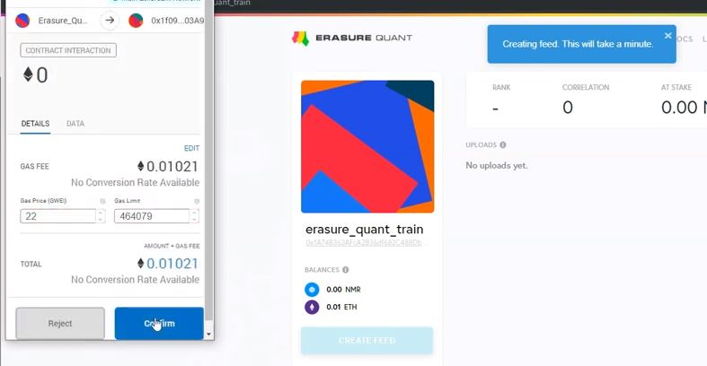

\(3:06\) Next, you’ll be confirming a transaction to interact with the erasure quant smart contract. Click Confirm, and wait for the transaction to clear.

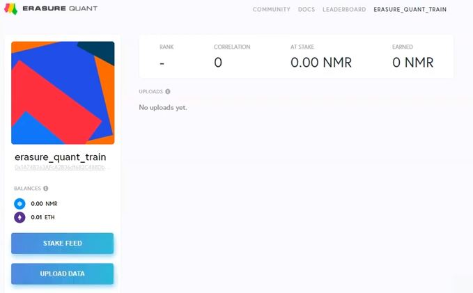

\(3:20\) Once the transaction is confirmed, the ‘stake feed’ and ‘upload data’ buttons will appear on your profile.

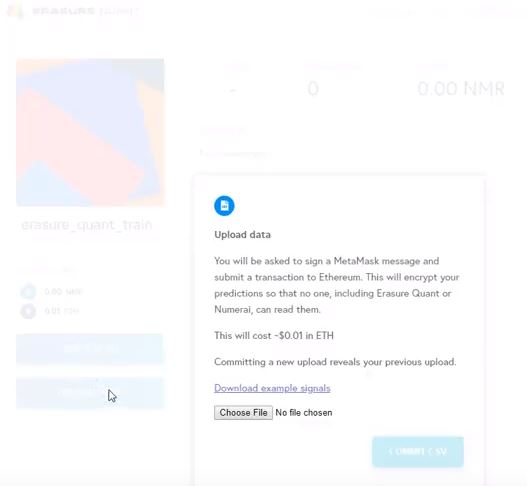

\(3:26\) If you click upload data, you’ll see a message and a ‘choose file’ button to upload your predictions. Example predictions are provided to give you a format to follow.

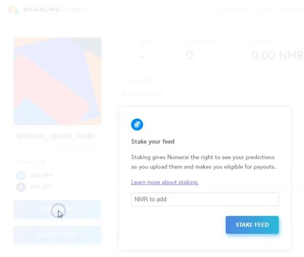

\(3:35\) Click stake feed. Here, you’ll see a message about staking Numeraire. Staking is the mechanism of payment, so if you don’t stake, you don’t earn. Best of luck, quants!

