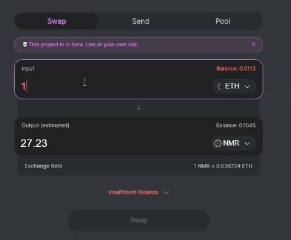
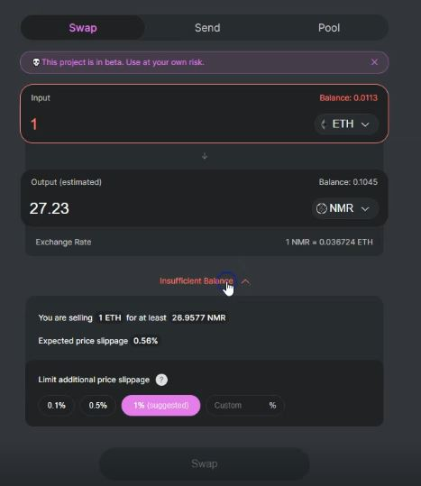
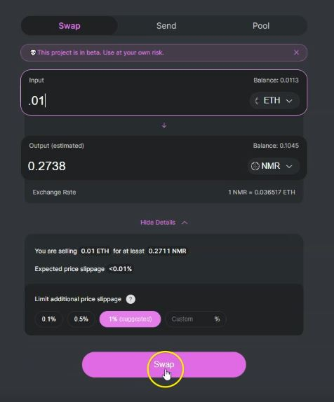
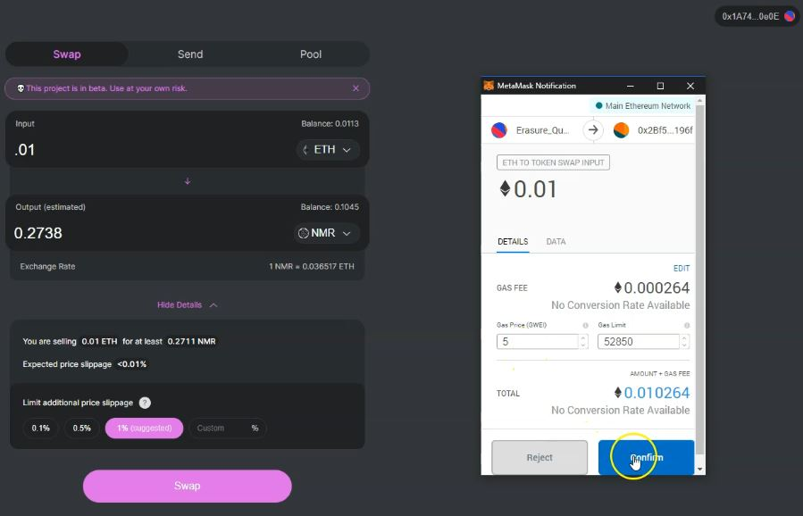
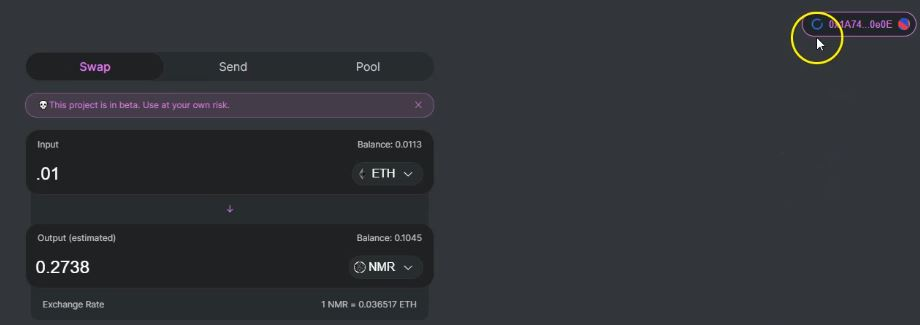
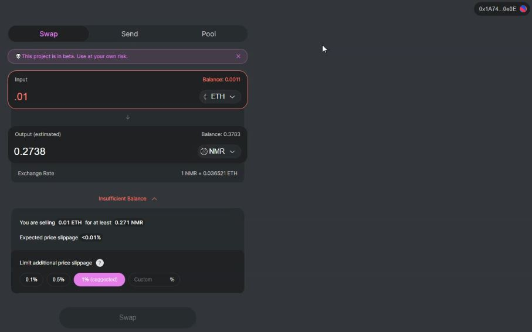

# Uniswap tutorial


A better version of Erasure Quant is being rebuilt inside of Numerai.   
You will be able to use your existing Numerai account to participate and it will be much more stable. No more Meta Mask. Coming Summer 2020.  
Stay up to date at [https://community.numer.ai](https://community.numer.ai/)



Erasure Quant payments are ending on Jun 12th, 2020. If you are currently staked, you should begin withdrawals as soon as you can.


Erasure Quant launched in 2019 and was a brand new kind of decentralized marketplace for stock market data built on Ethereum. It allowed anybody to upload signals, build a track record that anyone can verify, and earn money. [Read the original Medium post on why we built Erasure](https://medium.com/numerai/numerai-reveals-erasure-unstoppable-peer-to-peer-data-feeds-4fbb8d92820a).

A better version of Erasure Quant has been rebuilt inside of Numerai.   
Visit [Numerai Signals](https://signals.numer.ai) to learn more.

\_\_\_\_\_\_\_\_\_\_\_\_\_\_\_\_\_\_\_\_\_\_\_\_\_\_\_\_\_\_\_\_\_\_\_\_\_\_\_\_\_\_\_\_\_\_\_\_\_\_\_\_\_\_\_\_\_\_\_\_\_\_\_\_\_\_\_\_\_\_\_\_\_\_\_\_\_\_\_\_\_\_\_\_\_\_\_\_\_  
  
Video link: [https://youtu.be/p1uOex7cEP4](https://youtu.be/p1uOex7cEP4)

This tutorial assumes that you already know how to obtain Ether and that you've installed Metamask. By following this tutorial, you will understand how to swap Ether for Numeraire using [Uniswap](https://uniswap.io), which will allow you to use Numeraire to stake on your Erasure Quant Account.

First, visit [Uniswap](https://uniswap.io) and familiarize yourself with the documentation. Uniswap is a protocol for automated exchange of ERC20 tokens. You use metamask to interact with a smart contract that executes your exchange.

\(0:39\) Click Swap Tokens to get started.

\(0:42\) Click "Connect"

\(1:00\) Then click "Connect" in MetaMask. Now, you are able to select Numeraire as the ‘output’ token. 

\(1:13\) Click select a token and scroll down to Numeraire.

\(1:30\) As a test, type 1 into the Input field. You’ll see your actual balance in the top right of this cell and the estimated amount of Numeraire you’ll receive in the output cell. Below that, the exchange rate is displayed.

\(1:46\) 
Click the expansion to view the advanced information area. Here, you’ll see the exchange rate information in more detail. Your estimated slippage is displayed as well. Larger orders cause more slippage, so be mindful of that as you contemplate an exchange of Ether for Numeraire. You can place a limit on further slippage; you are encouraged to do so. 1% is probably sufficient for most users.

\(2:39\) Once you are satisfied with your exchange, simply click ‘Swap’.

\(2:56\) Click ‘confirm’ and wait for the transaction to confirm.

\(3:01\) MetaMask will show a swirling circle in the top right of the Uniswap page which shows you the transaction is pending.

\(4:05\) When the transaction clears, your account balances will update on the page. You can see that my Numeraire balance has increased, and my Ether balance has decreased. I’ve successfully swapped Ether for Numeraire!


Since I used my Erasure Quant MetaMask address, I can now stake on my feed. That’s all you have to do to obtain Numeraire. Certainly, there are other ways to obtain Numeraire, however this method has the least friction. Your mileage may vary, and you should do your own due diligence prior to exchanging cryptocurrency with any entity; cryptographically or not!

