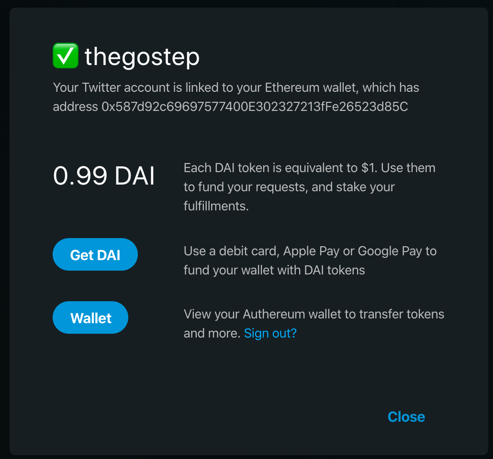

# FAQ

### **What is Erasure Bay?**

Erasure Bay is an unstoppable information marketplace built on top of the Erasure Protocol. The marketplace is fully decentralized and peer-to-peer. You can use Erasure Bay to [ask the internet for any information](faq.md#what-can-i-request). Be careful! Anyone can fulfill a request on a first come first serve basis to claim the reward, so make sure you get it right. When fulfilling a request, sellers must [put money at stake](https://docs.erasure.world/erasurebay-docs/faq#how-do-i-make-a-request) which gives the requester the ability to [punish their stake and their reward](faq.md#what-is-a-punishment) if they are unsatisfied.

### **What is Erasure Protocol?**

The Erasure Protocol is a new set of primitives which allows for building new kinds of applications on the internet. It solves many of the fundamental problems the internet has today. Find out more at [erasure.world](https://erasure.world/).

### **How do I get started?**

**Don't like to read?** Me neither. [Watch video tutorial here](new-bay-user-walkthrough.md)

**To view existing requests:** Follow [@ErasureBay](https://twitter.com/ErasureBay) on Twitter.

**To make or fulfill a request:**

1. Visit [erasurebay.org](http://erasurebay.org/) and click _**Sign In**_. 
2. Connect your [Authereum wallet](faq.md#what-is-authereum).
3. Connect your [Twitter account](faq.md#why-do-i-need-to-connect-my-twitter-account).
4. [Deposit money](faq.md#how-do-i-deposit-money) into your wallet.
5. You are ready to [make](faq.md#how-do-i-make-a-request) or [fulfill](faq.md#how-do-i-fulfill-a-request) a request!

### **What can I request?**

You can request anything that can be expressed in digital form. You can see existing request by following [@ErasureBay](https://twitter.com/ErasureBay) on Twitter to get a sense of what people are requesting. Fulfilling a request requires uploading a file that meets the expectation of the requester. It could be a dataset, a photo that proves a task was completed, a software vulnerability exploit, or anything in between. Video files, image files, text files; the possibilities are almost limitless. Maybe your business wants to host an infosec bounty program. Maybe you want to determine if your intellectual property is being traded on the Dark Web. You can make a request for any information and another user will fulfill it.

### **How do I make a request?**

Once you've decided what to request, it's time to start filling up your request details:

**Description**

The description is used to tell the world what information you are requesting. You can put anything here, it could be one sentence, or it could be a 100 page document. To get the best response possible, you should describe how you will determine if a response is good or bad.


🧙‍♂️**Hint:** To get the best response possible, you should describe how you will determine if a response is good or bad.


**Reward**

Before you can place the request, you need to make sure you've [deposited enough money in your wallet](faq.md#how-do-i-deposit-money) to pay the reward amount. For instance, if I requests 100 Baby Yoda memes and am willing to reward someone $1,000 for them, I first need to deposit at least $1,000 in my wallet. ****This reward will be locked in an escrow and added to the stake of the fulfiller when the request is fulfilled.


🧙‍♂️**Hint:** If you make a request but do not find anyone to fulfill it, you can cancel it from the request page to get the reward payment refunded.



🧞‍♂️**Be careful:** Once a request is fulfilled, you can no longer get the reward back. It is automatically added to the stake of the fulfiller. 


**Required Stake**

The required stake is the amount of money a fulfiller needs to attach to their fulfillment. By staking, fulfillers have skin in the game to support their claim about the quality of their information they submitted. Large stakes imply valuable information, and therefore greater potential compensation. Remember, the reward amount is added to the fulfiller's stake as soon a the request is fulfilled. For Erasure Bay, a stake is an amount of USD staked on the Erasure Protocol. It uses DAI stablecoins which has a value pegged to the US Dollar. One DAI is worth one USD.


🧙‍♂️**Hint:** If you are not sure what stake amount to ask for, you can always ask for $1B and add a note in your description saying you want to negotiate the details of the detail.



🧞‍♂️**Be careful:** Requests can be fulfilled by anyone on a first come first serve basis. Make sure your description is as specific as possible.


**Punishment Ratio**

Punishments keep sellers honest. When a fulfiller attaches a stake to their fulfillment, they give the right to the requester to burn their stake. This protects requesters since they can now punish fulfillers that provide incorrect or low-quality information. Burning a stake means that the money is deleted forever. A punishment is not free. In order to punish, the requester must burn an proportional amount of money according to the selected punishment ratio. An intuitive way to think about the punishment ratio is as how much it costs to punish $1 of the stake. For instance, if the stake is $1,000, the punishment ratio 0.1, and the requester wants to punish for $100 from the stake, then it will cost the requester $100\*0.1 = $10.

**Punishment Period**

The Punishment Period is the amount of time that the requester has to verify the quality of the information provided by the fulfiller. Within this window, the requester may punish the fulfiller’s stake if they are dissatisfied, but after this period of time, the information included in the fulfillment is deemed to be satisfactory and the stake is released. The requester can decide to release the stake early if they are satisfied with the submission.

### **How do I access my wallet?**

You can access your wallet by clicking on your profile name in the top right corner of your screen. This will open up your wallet page where you can see your [DAI balance](faq.md#what-is-dai), deposit money, or access your [Authereum account](faq.md#what-is-authereum).

### How do I deposit money?

Erasure Bay uses a stablecoin called DAI for payments and stakes on the marketplace. [What is DAI?](faq.md#what-is-dai) 

If you do not own any DAI yet, you can convert USD into DAI using [Wyre](https://www.sendwyre.com/). You must first sign in, click on your profile, then click the button that says **Get DAI**. This will redirect you to the page where you can convert USD to DAI using Debit Card, Apple Pay, or Google Pay depending on your browser. Wyre charges a fee to convert USD into DAI so make sure to account for it correctly.

If you already own some DAI, you can transfer it to your [Authereum wallet](faq.md#what-is-an-authereum-wallet) by using the ENS address or the Ethereum address.


🧙‍♂️**Hint:** Wyre can be unreliable for debit card payments. If you are having issues, try using Apple Pay on Safari for IOS.



🧙‍♂️**Hint:** Wyre charges a small fee to convert USD into DAI. Make sure to account for it.


### **Is my money safe?**

While nothing in life is risk free, you can rest assured your money is safe. Erasure Bay uses the [Erasure Protocol](faq.md#what-is-erasure-protocol) to secure your funds. Make sure you remember the following: 

* **Wallet Balance:** The money in your wallet is secured by the [Authereum](faq.md#what-is-authereum). 
* **Reward:** The money attached to a request reward is locked up in an escrow and can be fulfilled by anyone on a first come first serve basis. Once the request is fulfilled and the payment released, the reward is added to the fulfiller's stake and it is no longer possible for the requester to get it back. If no one fulfills the request, the requester can cancel the request to retrieve the reward.
* **Stake:** The money locked up in a stake includes the stake of the fulfiller and the reward of the requester. This stake is locked up in the escrow until the requester releases it or the [punish period](faq.md#how-do-i-make-a-request) is over. Be careful, the requester can burn the stake at any time during the punish period according to the [punish ratio](faq.md#how-do-i-make-a-request) if they are unsatisfied with the fulfillment.

### **Why use Twitter?**

Twitter fulfills multiple purposes on Erasure Bay:

1. Build trust amongst marketplace participants
2. Do content discovery through the bot [@ErasureBay](https://twitter.com/erasurebay)
3. Receive notifications when a request is fulfilled

We only ask for the [minimum OAuth permissions](https://developer.twitter.com/en/docs/basics/apps/guides/app-permissions) available to establish a provable link between your Authereum wallet and your Twitter account. This permission is a one time access.

### **What is Authereum?**

[Authereum](https://authereum.com/) is a wallet which allows you to store money that you can use with applications like Erasure Bay built on the [Ethereum blockchain](https://docs.ethhub.io/ethereum-basics/what-is-ethereum/). You can access your Erasure Bay account from any device by logging in with your Authereum username and password. You can use your Authereum account to [deposit money](faq.md#how-do-i-deposit-money) to Erasure Bay.

Authereum is a non-custodial wallet which means no one has access to your money. This means you do not have to trust anyone but yourself. Authereum makes it easy for non-technical users to keep their keys secure while providing advanced features. You can read [here](https://medium.com/authereum/authereum-key-architecture-explained-8e0781cf3ea0) if you’d like a more advanced understanding of Authereum’s contract-account architecture.


🧞‍♂️**Be careful:** Your Authereum account secures all the money and valuable information you submit to Erasure Bay. Make sure to choose a secure password and store it with a password manager like [1password](https://1password.com/) or [lastpass](https://www.lastpass.com/). For more tips on keeping your wallet secure, see the [Authereum blog](https://link.medium.com/maY63KJmK4).


### **What is DAI?** 

DAI is a digital representation of a US dollar. It's a stable cryptocurrency that runs on the [Ethereum blockchain](https://docs.ethhub.io/ethereum-basics/what-is-ethereum/). DAI's value is backed by cryptocurrency collateral, mainly ether, the currency of the Ethereum blockchain. Dai maintains its stability to the dollar by aligning market incentives among thousands of global actors. DAI allows for the use of smart contract platforms like the [Erasure Protocol](faq.md#what-is-erasure-protocol). 

You can learn more about stablecoins like DAI [here](https://blog.dharma.io/what-is-a-stablecoin/).

### **Does Erasure Bay use NMR?**

Yes. While Erasure Bay uses DAI for payments and staking, it [secretly burns up NMR in the background](https://medium.com/numerai/wheres-nmr-4b411db1e07c?source=friends_link&sk=1c1553ec198e3b486b9a40a39d2e4503).

### **What are the fees?**

Erasure Bay does not charge any fees to use the marketplace. This is possible through the magic of crypto-economic incentives. More on this soon.

### Still need help?

Contact us on [RocketChat](https://community.numer.ai/channel/erasure/) / [Twitter](http://twitter.com/numerai) / [Telegram](http://t.me/NMR_Official).

