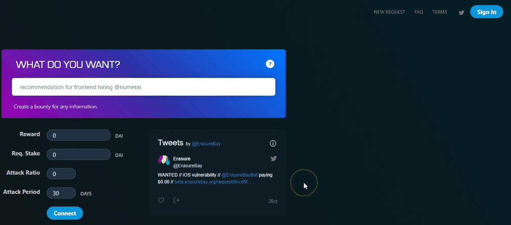
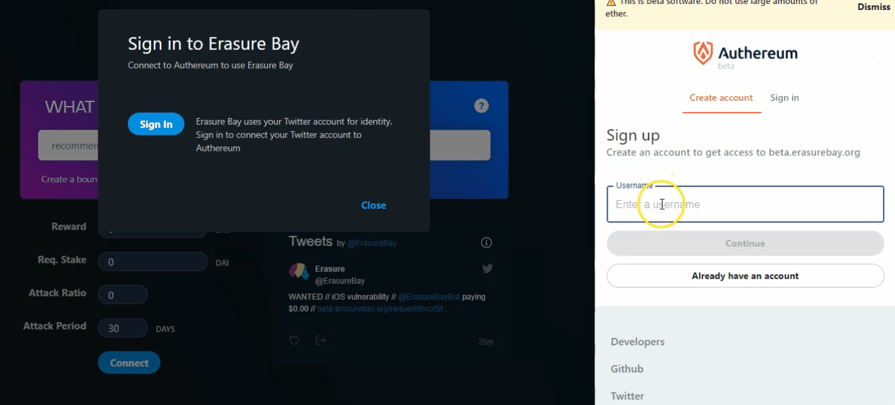
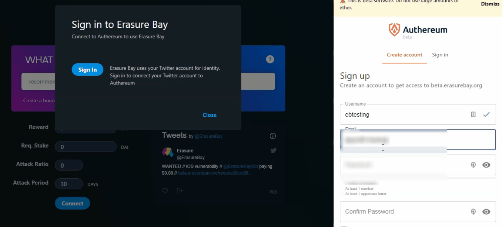
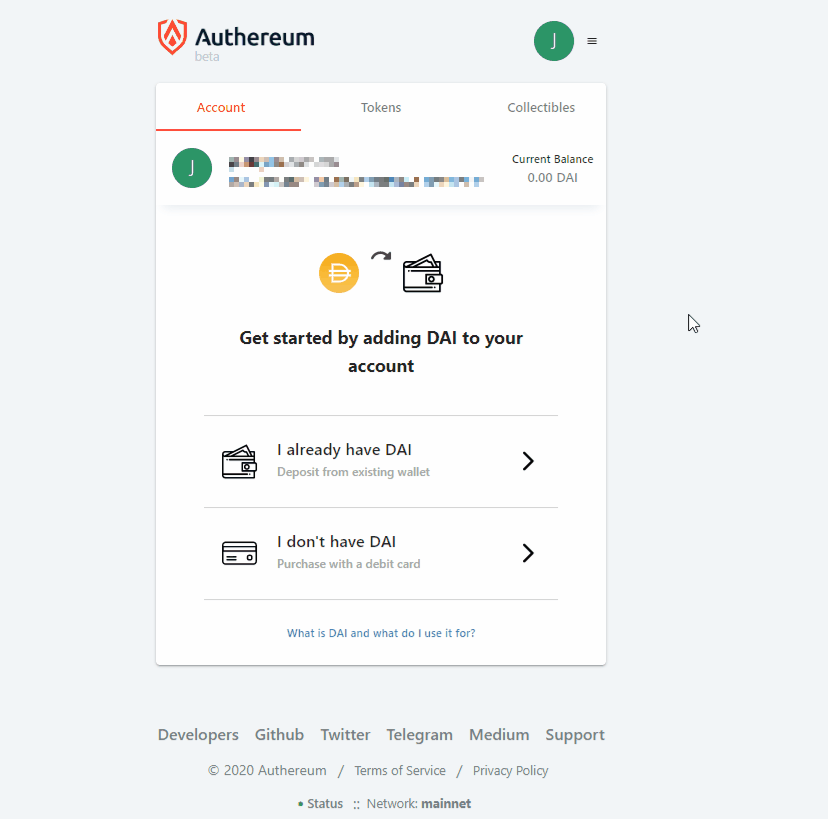
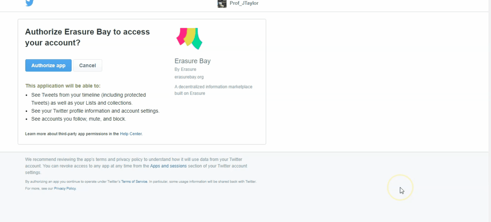
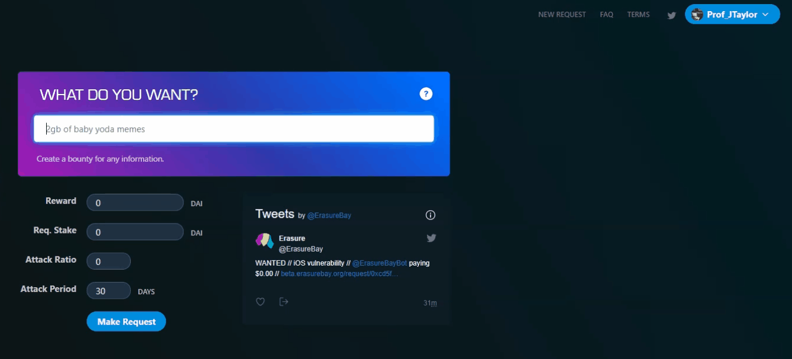
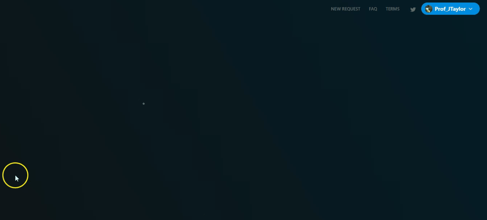

# New Bay user walkthrough

_Watch the tutorial walkthrough at_ [_YouTube_](https://youtu.be/0QpP05rqWUc)\_\_

Click "Sign In" and then click "Sign In."

Click "Create Account" and then type in your username and click "Continue."

Type in your email address and password, confirm your password, then click the check box to accept the Terms of Service and Privacy Policy. Click "Sign Up."

IMPORTANT NOTE! REMEMBER TO SAVE YOUR AUTHEREUM WORD SEED IN CASE YOU FORGET YOUR PASSWORD!

Activate your account with Authereum by clicking the link in the email sent to you by Authereum.

Authorize Erasure Bay to access your Twitter account by clicking "Authorize App." You will then be redirected to Erasure Bay.

Write your request, specify your reward, required stake, attack ratio and attack period, then click "Make Request." Click "Confirm."

That's it! You successfully made a request!

