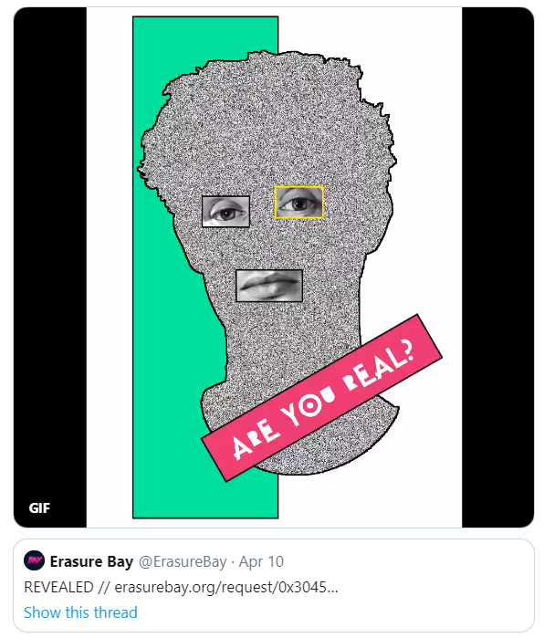

# Erasure Bay Office Hours \#3

Stephane and Jonathan kicked off the third Erasure Bay Office Hours by going over the [April Erasure update](https://medium.com/numerai/placeholder-thesis-design-update-aliens-exist-620c2459bedb). April was another exciting month with Placeholder's Erasure Investment Thesis, Erasure Bay updates, and possible evidence of extraterrestrials. 

### Erasure monthly update - April 2020

Read the [full post on Medium](https://medium.com/numerai/placeholder-thesis-design-update-aliens-exist-620c2459bedb) \| [Subscribe](https://upscri.be/r65sa5) to get Erasure updates directly to your inbox

**Placeholder Thesis**

[Joel Monegro](https://twitter.com/jmonegro) of Placeholder published their [investment thesis](https://www.placeholder.vc/blog/2020/4/9/erasure), inspired largely by the opportunity the VC firm sees in the Erasure protocol.

From the thesis:

> “It may be that the only way to distinguish good from bad information online comes down to how much value its creator stakes and their track record. That’s the vision of this protocol. And once you understand how it works, and its potential, it’s easy to see how it fits everywhere.” - Joel Monegro

**New Erasure Bay feature: Reveals**

Erasure Bay saw its first new feature with the introduction of public reveals for requests.

After a request is fulfilled, you can now choose to reveal the submission to the world, allowing anyone to download the file.

**Updated Frontend**

[Jonathan](https://twitter.com/jonathansidego) was hard at work updating the [Erasure Bay](www.erasurebay.org) frontend to make the experience requesting information even smoother.

**Staked on Erasure bot update**

The [Staked on Erasure bot](https://twitter.com/ErasureStaked) updated it's broadcasts to include total value staked on Erasure denominated in DAI as well as NMR. Tracking total DAI locked up in Erasure is one way to roughly gauge activity on Erasure Bay, which currently uses DAI for staking and rewards.

**Community analytics**

Fulfilling a [request for SQL abstractions](https://twitter.com/ErasureBay/status/1247898023822155786), Erasure Bay all-star [Klim](https://twitter.com/milkyklim) teamed up with [Richard Chen](https://twitter.com/richardchen39) to build an [Erasure Bay dashboard on Dune Analytics](https://t.co/tIMDPi1zCP?amp=1)

Data science team [Omni Analytics Group](https://twitter.com/omnianalytics?lang=en) did an in-depth analysis of some Erasure Bay metrics and produced an infographic:

**Most interesting requests**

[View this request on Twitter](https://twitter.com/ErasureBay/status/1255584011390349312) to see the revealed fulfillment.

[View this request on Twitter](https://twitter.com/ErasureBay/status/1244704227953274880) and submit your proof to collect the bounty.

[View this request on Twitter](https://twitter.com/ErasureBay/status/1257334193245347841) and sell out Epstein.

### Thoughts on the Erasure Bay design update

Jonathan explained that, in its earliest iteration, the Erasure Bay website was designed to be shipped ready to go with the basic first feature: requesting information from anywhere. As he described, it was an "MVP to get the thing working and see what people like and to get feedback." As mentioned in the [first](https://docs.erasure.world/office-hours/office-hours-recaps/erasure-bay-office-hours-1) and [second](https://docs.erasure.world/office-hours/office-hours-recaps/erasure-bay-office-hours-2) Erasure Bay Office Hours, the development roadmap for Erasure Bay would largely be determined by community feedback and how they use the product. 

> "Looking at the analytics and stats, most of our traffic is on mobile, because people are seeing the [Tweets](https://twitter.com/erasurebay) and then coming straight from those Tweets to the website. So, I spent most of the time making mobile look really good because that's most people's first interaction with Erasure Bay."  - Jonathan

Another focus for this redesign was education. Because the first version was a little "scary to use" as Jonathan said, the new design incorporates more concise explanations for how Erasure Bay works presented in a more intuitive layout.

Jonathan mentioned that work on Erasure Bay is an ongoing process, so if you have any feedback, he encourages you to [slide into his DMs on Twitter](www.twitter.com/jonathansidego) or message him on [Rocket.Chat](www.community.numer.ai).

### Questions from Slido

**There should be a way to signal your interest in fulfilling a request, useful if it requires considerable effort or if others have better progress.**

Jonathan totally agrees that this would be a useful feature. Using the skate park request as an example, Jonathan pointed out that if 12 people tried to fulfill that request, 11 would end up being unhappy because currently, only one person can fulfill a request.  ****

This feature is something the team has discussed, although it's not on the roadmap for the immediate future at this time. The initial version of the Erasure Bay app is meant to be the simplest form possible - a streamlined way to request information from anywhere on the internet. "We chose simplicity instead of optionality for the first version," Jonathan said, "but we do have a few ideas on how we can make it so that when you see a request, you can stake, but then you can fulfill and submit a little bit later."

**Have you considered adding the ability to burn only the fulfiller's stake and return the bounty to the requester? Having to burn the bounty doesn't make sense.**

> "It is scary" - Jonathan

Jonathan explained that if he were to create a bounty for someone's phone number, and [NJ](www.twitter.com/tasha_jade) fulfills the request with the correct phone number, if he could take his reward back, he could look at the phone number NJ provided and then just run away without giving her the reward. That's why in the current Erasure Bay iteration, once someone fulfills the request, the requester can **no longer** get the reward back. Jonathan admitted this is not ideal for all situations, such as if the fulfiller is guessing or not 100% certain in their answer like the [request for a mushroom identification](https://twitter.com/ErasureBay/status/1257344004196372483). In that situation, the fulfillment ended up being wrong, so the requester lost their reward plus the amount used to burn the fulfiller's stake. 

> "The way that Erasure Bay is set up at the moment is that it's mostly for if someone _knows_ they have the correct answer when they're fulfilling." - Jonathan

There are a lot of mechanisms around staking and rewarding that Numerai can tweak to change the Erasure Bay experience, but Jonathan reiterated that the most important step in the beginning was to get the simplest version of the app functioning brilliantly.

**Any ideas on the road for Quant ahead?**

The Numerai team has been hard at work building a revamp of Erasure Quant. The idea behind the update is to make the Quant tournament closer in architecture to the main Numerai tournament.

_Author’s note: The Erasure Quant revamp, called Numerai Signals, is in beta as at June 4, 2020. Check out_ [_Numerai Signals_](https://signals.numer.ai/tournament)_, read the_ [_Signals docs_](https://docs.numer.ai/numerai-signals/signals-overview)_, or join the conversation on_ [_Rocket.Chat_](https://community.numer.ai/channel/signals)_._ 

**If it be possible to distribute the reward among several fulfillers, that would be the first step to create a data science competition. Can that be done?**

There are no immediate plans to implement anything like this, but Jonathan does like the idea.

The way the Erasure protocol is designed, modifying the simplest version of Erasure Bay \(one requester, one fulfiller\) would be as simple as a plugin for the underlying smart contract. While it would be relatively straightforward to expand functionality to support multiple requesters pooling a reward or allowing multiple fulfillments, the Numerai team is focused on polishing the initial iteration of Erasure Bay and encourages the community to request or build any of these extensions that they want to see.

Jonathan mentioned that one of the current internal priorities is expanding the documentation around the Erasure APIs and SDKs so that it's much easier for someone to build their own Erasure app that's more customized to their use case.

**Is privacy on Erasure Bay something that has been considered? If so, how do you balance that with reputation? Without that, undesirable parties can't be controlled.**

Regarding privacy, Jonathan mentioned that everything is encrypted, end-to-end, so not even Numerai can see what's inside any fulfillment \(it's encrypted at the browser level\). 

Reputation management is one of the reasons the team decided to integrate Erasure Bay with Twitter. That gives Erasure Bay users a way to have some idea of who they're buying from or selling to - the Erasure Bay UI even displays the blue check for verified Twitter users.

As for privacy in regards to protecting anonymity, Jonathan explained that the team made the decision to require signing up with Twitter as a way to provide an identity layer. In its current form, users don't need to sign up for an Erasure Bay account, they just need a Twitter account and an Authereum account. Requiring a Twitter account serves as an effective bot / spam account filter, as well. Jonathan pointed out that if you truly want to make a request anonymously on Erasure Bay, making a new Twitter account is relatively simple.

**There should be a way to ask for clarification about a request.**

This is another reason why the team chose to integrate with Twitter. As Jonathan mentioned, if you're looking for clarity around a request, you can simply DM them or Tweet at them. Jonathan brought up his [Epstein request](https://twitter.com/ErasureBay/status/1257334193245347841) and how he added more information and context in additional Tweets below the original request.

If you want to add even more detail to your request, you could link to pastebin for more text, Dropbox for PDFs or other files, or Imgur for pictures.

**Should there be a way for participants to start accruing reputation for their fulfilled requests? Does it make sense to record recent reputation like Numerai?**

> "Yes, yes, a thousand times yes!" - Jonathan

The [dashboard that Dune Analytics and Milky Klim built](https://explore.duneanalytics.com/public/dashboards/ztIjeHLFYVvyX0OCrorKWUeNNSkhNWG1IBS2I1PO) starts to show reputation as it includes lists of the top requesters and top fulfillers, ranking wallet addresses by the total value of their requests and fulfillments. "That is something we want to do more with," Jonathan said, "and probably soon. Some sort of leaderboard, we think, so you can see who the heroes are."

**What if people are too agreeable to burn someone's stake?**

> "Then you're on the wrong website buddy, what can I say? You don't have to burn someone and you can just say, 'cool, give me the wrong information and I'll gladly pay you for it,' but I think that's a horrible way to live your life." **-** Jonathan

**Could this work as an alternative to contract law? E.g. if the user or client expected something, and the seller provided was insincere, they're punished.**

> "**💯" -** Jonathan

Jonathan mentioned a contractor Numerai hired to do some frontend work on Erasure Bay who ended up having a portion of their pay [burned for being late to meetings](https://twitter.com/ErasureBay/status/1242949419714015232). 

Blockchains are essentially computer software that can enforce conditions, and smart contracts are designed to hold all parties accountable without the need for a court system to arbitrate.

**What if you want to give someone the benefit of the doubt and you don't want to burn them?**

Henry, who asked the question and was on the call, elaborated that, from an interpersonal perspective, it's disagreeable to burn someone. Referring back to the mushroom ID, Henry suggested that the fulfiller potentially made their best effort and were convinced they were supplying the correct information. "Maybe you didn't specify clearly enough what you wanted," Henry said, "and that's **your** fault."

Jonathan suggested one option would be releasing the entire stake and then asking the fulfiller to send your reward back. [Arbitrage](https://numer.ai/arbitrage) pointed out that the person making the request has a reputation on the line a well, saying, "If I make a bad request, then I'll have a reputation for not being clear and that's traceable through Twitter. I think it works both ways, without having to be too conscious of contract law."

If someone makes an unclear request on Erasure Bay and it gets fulfilled with a file that isn't what the person wanted, they lose their entire reward plus the amount required to burn the fulfiller's stake. This serves as an incentive for requesters to be clear in their descriptions, and holds them accountable for acting in good faith just like the fulfillers. As time progresses and more people use Erasure Bay, community norms will develop around how specific requests should be, conventions for adding extra information, how high the required stake should be to fulfill, and acceptable levels of risk in the punish ratio and length of punish period. 

**From chat: If Erasure solves the issue of trusting strangers on the internet, is there a way to set up a two-way contract with someone? E.g. I have a startup idea and I'm looking for someone with X, Y, Z skills to start it with me, how do I stop them from stealing the idea and have a contract where we're both incentivized to work?**

In theory, a smart contract can represent an agreement over anything, so this kind of two-way contract is possible. A contract could be created for a potential co-founder to stake some dollar amount for a given period of time in the early days of the company, but the challenge would be to find someone who would actually agree to those terms. Smart contracts are not necessarily optimized for every type of deal.

**Are there plans to allow a fulfiller to take on a loan to stake with staking on margin? Could be useful if the user knows they're correct but are under-capitalized.**

**Arbitrage:** That sounds like a hedge fund idea - just start a fund and do loans for staking.

**Jonathan:** That's a crazy idea.

Jonathan pointed out that while it may be viewed as a weakness, requiring stake to fulfill a request is more of a feature in that having to put skin in the game by having to risk something is an essential component of the Erasure Bay equation.

> "If you don't have anything to lose, you don't have anything on the line so you can just send a 💩 answer." - Jonathan

Jonathan was excited by the idea of people taking out loans to stake to fulfill requests, he said it could be built as a second layer to Erasure Bay and Numerai wouldn't need to be involved.

**Are there any plans to create a content-specific version of Erasure Bay that's designed for a specific use case?**

Jonathan said that the very first iteration of Erasure Bay was a market for buying and selling software exploits. Ultimately, the team concluded that they don't know what the most useful application of Erasure Bay will be. On launch, they decided to make Erasure Bay as general as possible so they could see what people decided to use it for.

While Jonathan doesn't think that Numerai will do much to create vertical-specific versions of Erasure Bay, he again pointed out that they are working on expanding the documentation around the APIs and SDKs so the community can easily build whatever flavor of Erasure Bay they want.

If you have any feedback or ideas, share them in the [Erasure Community Chat](https://go.rocket.chat/invite?host=community.numer.ai&path=invite%2F9L7egf) or on Twitter by tagging [@ErasureBay](https://twitter.com/ErasureBay). Or you could be really cool and request the feature on [erasurebay.org](https://erasurebay.org/).

Haven’t used Erasure Bay yet? Check out [this tutorial](https://app.gitbook.com/@numerai/s/erasure/erasurebay-docs/new-bay-user-walkthrough) to set up your accounts and start making requests.

Don’t want to miss the next Erasure Bay office hours? Follow [Numerai on Twitter](https://twitter.com/numerai) or join the discussion on their [Telegram channel](https://t.me/NMR_Official) or [RocketChat](https://community.numer.ai/home).

Make sure you [subscribe here](https://upscri.be/r65sa5) get the Erasure monthly updates delivered straight to your inbox.

